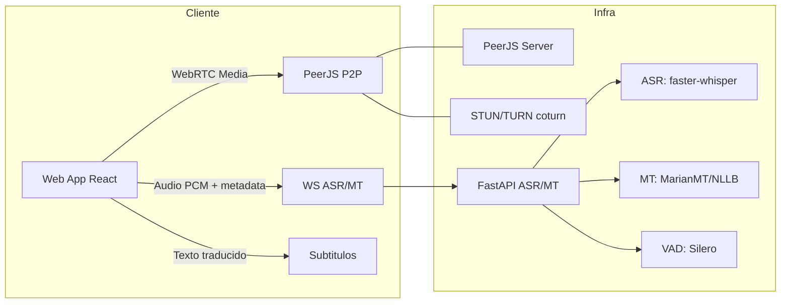

# Arquitectura Low-Cost (Propuesta)

## Objetivo
Reducir costos de inferencia y dependencia de proveedores pagos, manteniendo subtitulos en vivo con baja latencia. La propuesta usa modelos open source y un microservicio ASR/MT via WebSocket.

## Diagrama (alto nivel)


## Componentes
- Cliente: captura audio, aplica VAD ligera, envia chunks PCM al servicio ASR/MT, renderiza subtitulos y reenvia al peer.
- ASR/MT: servicio WebSocket con ASR streaming + traduccion incremental.
- WebRTC: PeerJS para signaling y coturn para atravesar NAT.

## APIs (propuesta)

### WebSocket ASR/MT
- Endpoint: `ws://<host>:8001/ws/asr-mt`
- Protocolo: JSON control + binario PCM 16-bit LE a 16kHz (mono).

#### Mensajes de control (JSON)
```json
{
  "type": "config",
  "session_id": "uuid",
  "source_lang": "es",
  "target_lang": "en",
  "sample_rate": 16000,
  "format": "s16le"
}
```

```json
{
  "type": "end"
}
```

#### Frames de audio (binario)
- Payload: PCM 16-bit little-endian, mono, 16kHz.
- Chunk recomendado: 20-40 ms (320-640 frames).

#### Respuesta del servidor (JSON)
```json
{
  "type": "partial",
  "text": "hola",
  "translated_text": "hello",
  "timestamp_ms": 1200
}
```

```json
{
  "type": "final",
  "text": "hola, como estas",
  "translated_text": "hello, how are you",
  "timestamp_ms": 1800
}
```

## Requisitos de red y seguridad
- Usar TLS en producción (wss/https).
- TURN con credenciales rotadas.
- Limitar tamaño de mensajes y rate-limit por sesion.

## Notas de latencia
- AudioWorklet con buffers 128-512 frames.
- VAD antes de enviar para reducir ancho de banda.
- Evitar MT en lote; preferir traduccion incremental.
